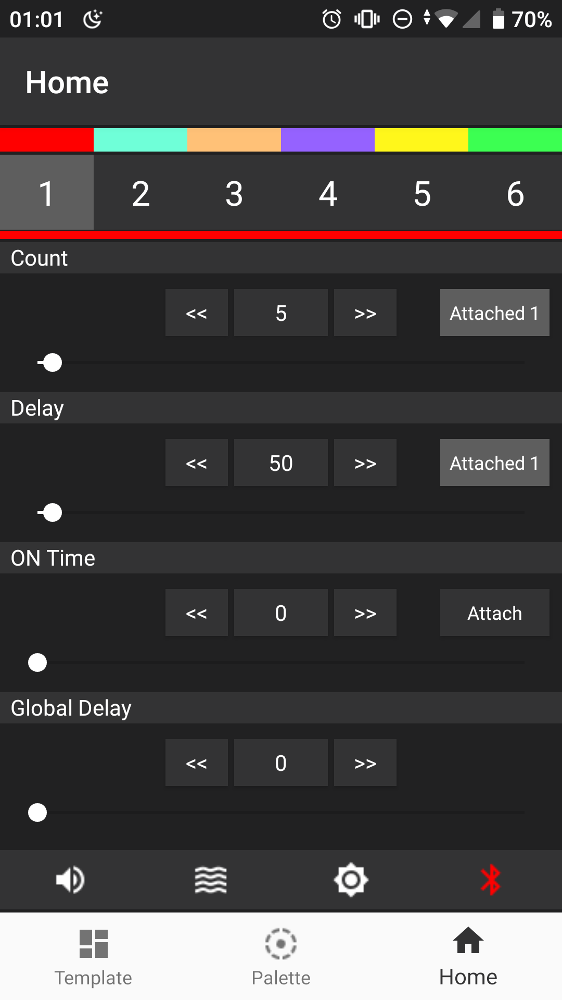
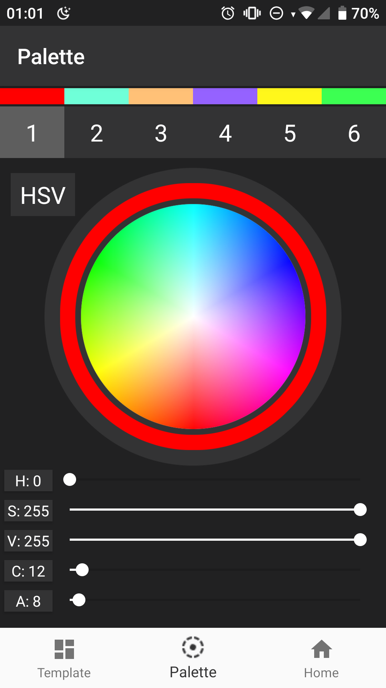
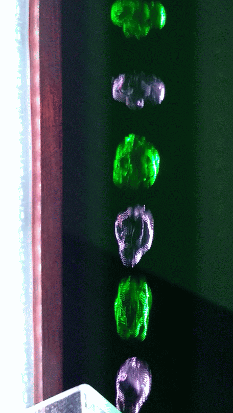
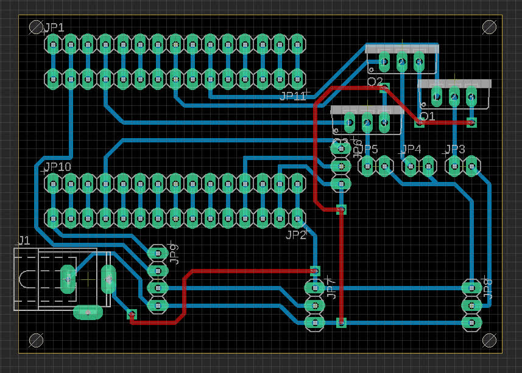
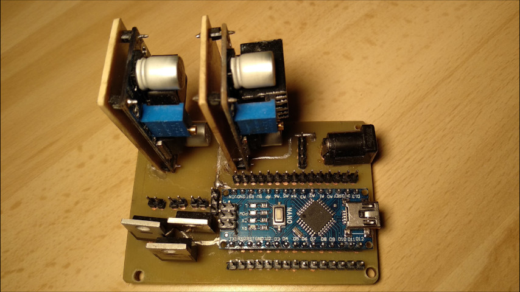

# Strobe
Repository contains Arduino program and Android application used for one of my physics projects in high school. The project was a device to show stroboscopic effect on a stream of water.
Embedded (Arduino) program controls the operation of the device like colors of RGB LEDs, electromagnet, water pump. Android app provides easy to use interface to remote change parameters (frequency, colors etc.) in realtime by bluetooth.

## Android app
| Home | Palette |
| - | - |
|  |  |

##### Android app tested only on Xiaomi mi A1

## Example of effects
| | | | |
|-|-|-| - |
| |  |  |  |

## Board

|||
|-|-|
|  | |
